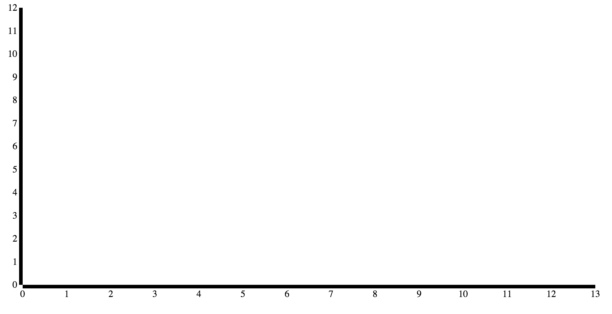
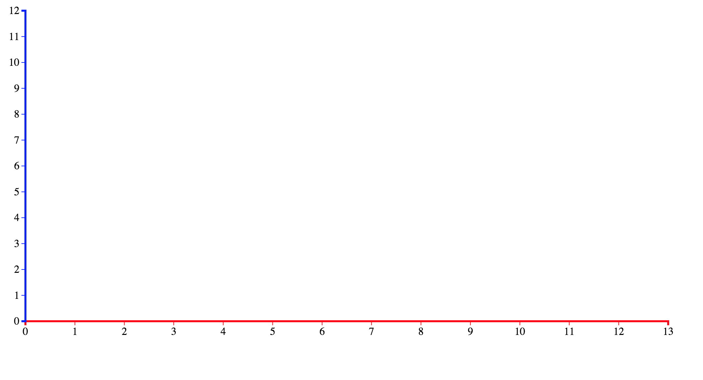
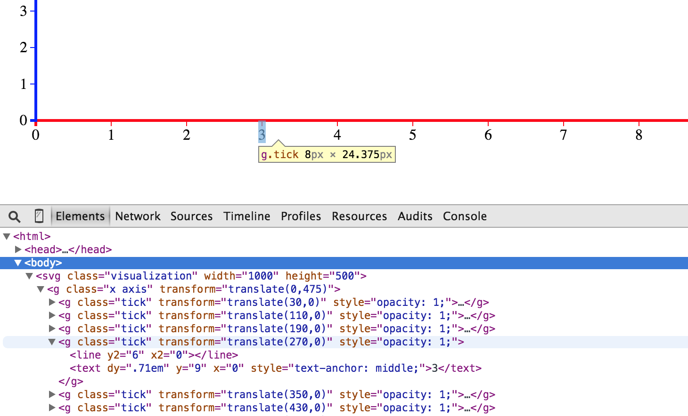
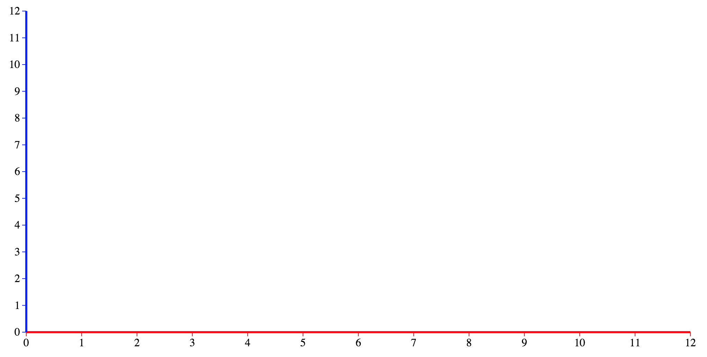
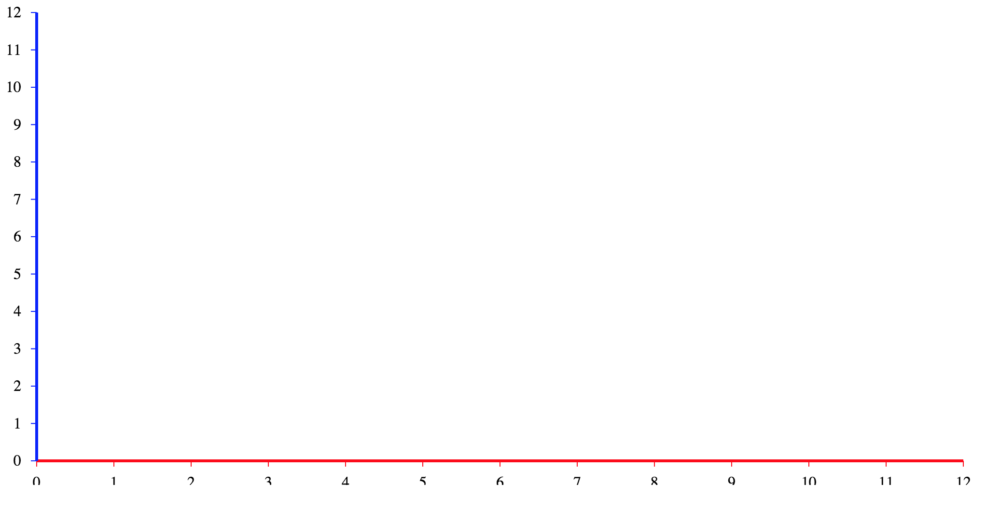
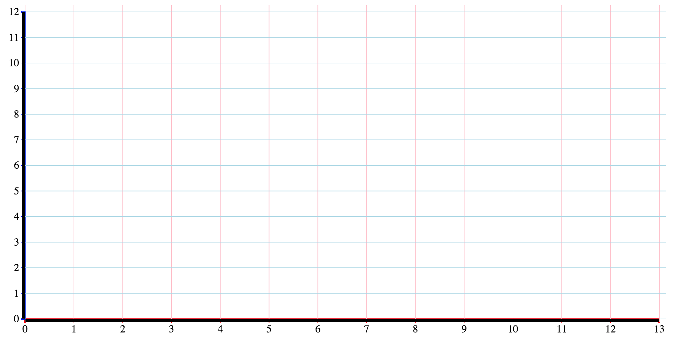
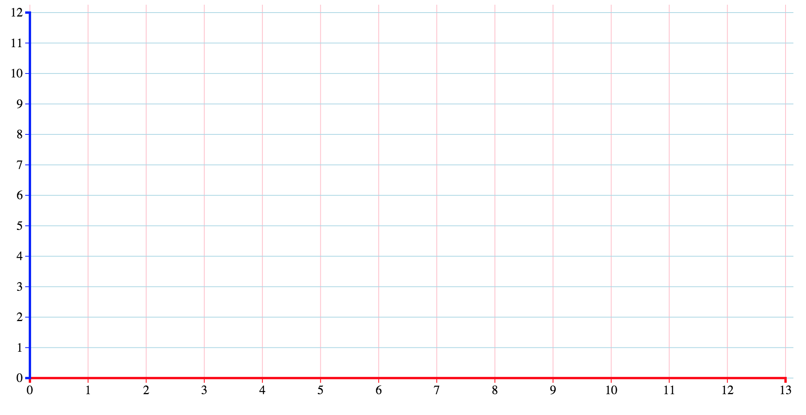

# Creating a Simple Graph through d3.js

Making a simple graph in D3. Js.

Includes...

* x axis
* y axis
* grid

## Downloading the Files

* The code written is done through D3.Js and will require you to first go to their website [here](http://d3js.org/).
* After downloading, place the file in a folder with the html doument that you will be using to edit.


## Drawing the Axes

### <a> Height and Width Settings </a>
* Create an svg element with a unique class name and a script element with an src that directs to the file that was downloaded.

```
<svg class="visualization"></svg>
<script src='d3.js'></script>
```
* In another `<script>` header, create variables with a height and width to set your svg body and margins so that the graph will not get cut off.

```
var width = 1000;
var height = 500;
var margins = {
          top: 10,
          right: 10,
          bottom: 25,
          left: 30
        };
```

The graph that you will be making will be in this header.


```
var svg = d3.select(".visualization");
svg.attr('width', width);
svg.attr('height', height);

```


### <a> Scaling and Creating Axes</a>
**Scaling is important since it allows the graph to stay in the svg element. Make sure to do this properly or else your graph may have errors**


* xScales and yScales are used to set the domain (minimum and maximum values that are wished to be displayed in the axis) and the range (the values that the SVG will be covering). It is important to set your margins in your scales so that the axes and grids do not get drawn past the body.

```
var xScale = d3.scale.linear().domain([0, 12]).range([margins.left, width - margins.right]);
var yScale = d3.scale.linear().domain([0, 12]).range([height - margins.bottom, margins.top]);
```

* The method linear() creates a linear scale on axes. Since the default domain and range for this method is `[0,1]`, you can change the domain and range which can fit your graph.

* After Scaling the x and y axes, make variables xAxis and yAxis and set the lengths with the scale variables that were created.

```
var xAxis = d3.svg.axis().scale(xScale).orient("bottom").ticks(12);
var yAxis = d3.svg.axis().scale(yScale).orient("left").ticks(12);
```

* `d3.svg.axis()` means that in d3, you want svg to make a new axis. The axis can be unique and you are able to add more attributes to the axis. With the attributes that are called, the axes are able to scale and orient themselves to a specific length and position.

**In order for the ticks to go at single increments, you will need to set both the domain from `xScale` and `yScale` equal to the specified number of ticks in `xAxis` and `yAxis`.

### <a> Appending the Axes </a>
* After scaling and applying styles to your axes, the axes can be drawn and appended to the svg body.

```
svg.append("g")
            .attr("transform", "translate(0," + (height - margins.bottom) + ")")
            .call(xAxis);
 
svg.append("g")
            .attr("transform", "translate(" + (margins.left) + ",0)")
            .call(yAxis);
```
* The d3 element `<g>` is being appended with the attributes of each axis.
* The transform attribute has a string concatenation. Instead of what is written above, you can simply just find the margin values and put them into this attribute.
* This attribute can be simplified to `translate(x, y)` where x moves the object in the x direction and y moves the object in the y direction.
	* the object will be moving from the left to the right in the x direction and from the top to the bottom in the y direction
	
**The margins are used so that the graph does not cut off by the body. By adding these margins, you are translating the axes to a specific cordinate so the axes do not get cut off.**

Your graph should currently look like this.




### <a> Styling the Axes </a>
The graph does not look that great and should be changed with CSS selectors.

```
.x.axis path, .x.axis .tick line {
           stroke: red;  //this can be any color you want
         }
  
.y.axis path, .y.axis .tick line {
          stroke: blue;
        }
 
.axis path {
          fill: none;
          shape-rendering: crispEdges;
          stroke-width: 3;
        }
```
* `.x.axis` and `.y.axis` were made to make the path and tick line have a specific color.
* `.axis path` is created so that the edges of the axes are not as thick and the black `fill` selector does not default to black and cover up the colored axes.
* We'll be using different colors to differentiate the two axes
* the shape-rendering selector only makes the rendering more crisp.

### <a> Calling the Selectors </a>
**You will also need to change an attribute for each appending axis so the CSS selectors are called.**

```
svg.append("g")
            .attr("class", "x axis")
            .attr("transform", "translate(0," + (height - margins.bottom) + ")")
            .call(xAxis);
 
svg.append("g")
            .attr("class", "y axis")
            .attr("transform", "translate(" + (margins.left) + ",0)")
            .call(yAxis);
```


* The selectors in CSS are called by the *x axis path* and *y axis path*. Inside these paths, the *tick line* and color are getting changed

Your graph should now look like this



The initial graph with black axes were extremely thick which covered the tick marks. Now that the axes are thinner, you are able to clearly see each tick mark. A mark and number are assigned to the element `<g>` .This element was appended under the section <a>Appending the Axes</a>



*svg is appending the element `<g>`. The `<g>` element is a container used to group objects (tick marks and numbers) together. Below shows a graph that has grouped the number and tick grouped together into one element (which is what the code above is doing)*


* Other fancy attributes can be used as well and are found in any CSS reference. You can click [here](http://www.w3schools.com/cssref/) to look at a reference from w3schools.

* If you do not like the way the graph "brackets" at the end of each axis, you can call an attribute called `outerTickSize` which can change the length of the outer ticks. This attribute can be called when you are setting your x and y axis.
	* Setting the outer ticks to `0` will get rid of them.

```
var xAxis = d3.svg.axis().scale(xScale).orient("bottom").ticks(12).outerTickSize(0);
var yAxis = d3.svg.axis().scale(yScale).orient("left").ticks(12).outerTickSize(0);
```

If you set them to 0, it will look like this.



Keep in mind that there are still tick marks on the end of each axis. These tick marks are on each number.


*If you think that the numbers are too close to the tick marks, the `tickPadding()` method can be very useful to you. You can use this method when setting your x and y axes.

```
var xAxis = d3.svg.axis().ticks(12).outerTickSize(0).scale(xScale).orient("bottom").tickPadding(10);

var yAxis = return d3.svg.axis().ticks(12).outerTickSize(0).scale(xyScale).orient("bottom").tickPadding(10);
```



Compared to the picture above without `tickPadding()`, you can easily tell that it has moved further away from the tick marks.

**The numbers on the x axis is cut off due to the svg body. The svg body is limiting the amount of area each object can cover. You can simply fix this by changing the height of your svg body.**


## Drawing the Grid
Now that the x and y axes are done, the grid can be made. 


### <a> Generating the Grid Lines </a>
* Functions are required to generate the gridlines. The function will be used to scale and orient the grid with a specific amount of tick marks.

```
function xGrid() {
          return d3.svg.axis()
          .scale(xScale)
          .orient("bottom")
          .ticks(12)
        }

function yGrid() {
          return d3.svg.axis()
          .scale(yScale)
          .orient("left")
          ticks(12)
        }
```


* The return line for each function returns the axis of the grid with the attributes (scale, orient, ticks) that it has.

* The rest of these methods have already been discussed and should be self explanatory by now.


###<a> Appending the Grids </a>
After defining the styles of the grid lines in CSS and the functions in JavaScript, you can now draw and append the grid into the svg body.


```
svg.append("g")
            .attr("class", "x grid")
            //String concatenation
            .attr("transform", "translate(0," + (height - margins.bottom) + ")")
            .call(xGrid()
                .tickSize(-height, 0)
                .tickFormat(""));
 
svg.append("g")
            .attr("class", "y grid")
            .attr("transform", "translate(" + (margins.left) + ",0)")
            .call(yGrid()
                .tickSize(-width, 0)
                .tickFormat(""));
```


The only new methods that have not been gone over so far are tickSize() and tickFormat().

* When looking at how height and width work, the top left corner of the screen has the x and y coordinates set as 0. However, in SVG, when a negative value is given, SVG will draw it upside down.
* The second argument displays the thickness of the grid axis line. If you set it to 5, you are able to see how the grid in this program works.




* Since we do not want the tickFormat to change, we will be setting nothing to tickFormat.

**The grid right now should not be showing since we have not created a CSS selector. Therefore it should still look the same as before.**

### <a> Styling Your Grid Lines </a>
* We can first make two CSS classes to define the styles that the grid lines will have. These commands are essentially what you did for the x and y axes styles

```
.x.grid {
          stroke: pink;
          stroke-width: 1;
        }
 
.y.grid {
          stroke: lightBlue;
          stroke-width:1;
        }

```


* x grid and y grid have different strokes so that you are able to differentiate them. You can change the colors if you wish.

*You can always make a universal class (ex. .axis.grid) instead of two different ones, but it is better this way in case you want to change a specific axis but not the other one.*


##Final Changes


###<a> Code Order </a>
The way SVG adds elements, the old elements end up in the back and the new elements end up in the front. Since we want the axes to be on top, make sure to add the axes AFTER adding the grid.

The final graph should look like this.



If you take a look at my coding, the body where I wrote my scripts may seem a bit different. The only difference is that I made a `main()` function which held the step by step order on how the graph is made. I also added functions for each body of code so that everything is able to be called in the `main()` function. Make sure to create instance variables so that errors do not occur.